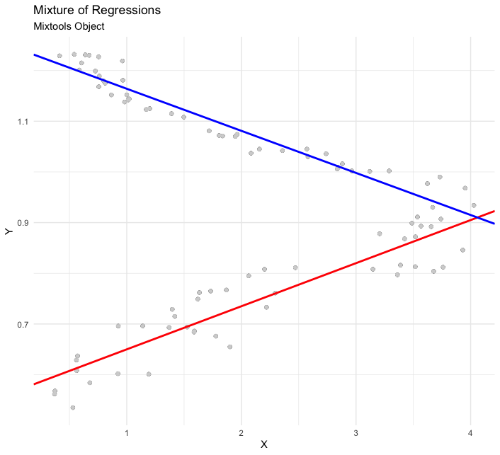
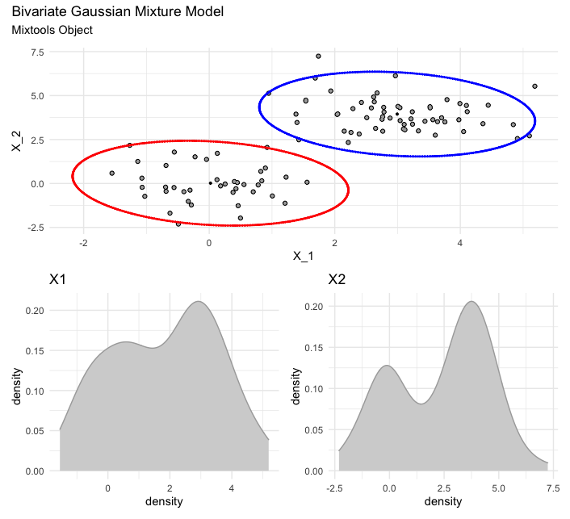
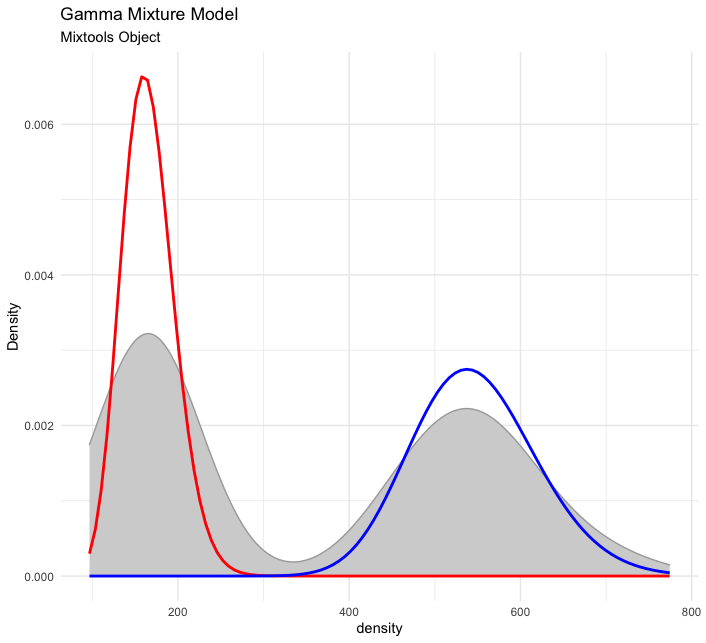

# `plotmm` Tidy Tools for Visualizing Mixture Models
[](http://cran.r-project.org/package=plotmm)
[](https://github.com/pdwaggoner/plotmm/pulls)
<!-- [](http://www.r-pkg.org/pkg/plotmm) -->
<!-- [](http://cranlogs.r-pkg.org/) -->

---
#### [`plotGMM`](https://CRAN.R-project.org/package=plotGMM):
[](http://cran.r-project.org/package=plotGMM)
[](http://www.r-pkg.org/pkg/plotGMM)

---

Package authors and contributors:
  - [Philip D. Waggoner](https://github.com/pdwaggoner) (pkg maintainer), University of Chicago
  - [Fong Chun Chan](https://github.com/tinyheero), Achilles Therapeutics
  - [Lu Zhang](https://github.com/LuZhang0128), Emory University

---

In collaboration with [Fong Chan](https://github.com/tinyheero) (Achilles Therapeutics) and [Lu Zhang](https://github.com/LuZhang0128) (Emory University), we have developed `plotmm` for tidy visualization of mixture models. This package is a substantial update to the [`plotGMM` package](https://CRAN.R-project.org/package=plotGMM).

The package has five functions: 

1. `plot_mm()`: The main function of the package, `plot_mm` allows the user to simply input the name of the fit mixture model, as well as an optional argument to pass the number of components `k` that were used in the original fit. *Note*: the function will automatically detect the number of components if `k` is not supplied. The result is a tidy ggplot of the density of the data with overlaid mixture weight component curves. Importantly, as the grammar of graphics is the basis of visualization in this package, all other tidyverse-friendly customization options work with any of the `plotmm`'s functions (e.g., customizing with `ggplot2`'s functions like `labs()` or `theme_*()`; or `patchwork`'s `plot_annotation()`). There are examples of these and others below.  

2. `plot_cut_point()`: Mixture models are often used to derive cut points of separation between groups in feature space. `plot_cut_point()` plots the data density with the overlaid cut point (the mean of the calculated `mu`) from the fit mixture model. 

3. `plot_mix_comps()`: A helper function allowing for expanded customization of mixture model plots. The function superimposes the shape of the components over a `ggplot2` object. This function is also used to render all plots in the main `plot_mm()` function.

4. `plot_gmm()`: The original function upon which the package was expanded. It is included in `plotmm` for quicker access to a common mixture model form (univariate Gaussian), as well as to bridge between the original `plotGMM` package.

5. `plot_mix_comps_normal()`: Similarly, this function is the original basis of `plot_mix_comps()`, but for Gaussian mixture models only. It is included in `plotmm` for bridging between the original `plotGMM` package.

The package supports several model objects (from 'mixtools', 'EMCluster', and 'flexmix'), as well as many mixture model specifications, including mixtures of: 

1. Univariate Gaussians
2. Bivariate Gaussians
3. Gammas
4. Logistic regressions
5. Linear regressions
6. Poisson regressions

## Installation

Dev version: `devtools::install_github("pdwaggoner/plotmm")`

Stable release (v0.1.0) on CRAN: `install.packages("plotmm"); library(plotmm)`

### Tidy visualization of mixture models via `plot_mm()`

First, here is an example for univariate normal mixture model:

```{r }
set.seed(123)
out <- mixtools::normalmixEM(iris$Petal.Length, k = 2)

# visualize
plot_mm(out, 2) +
  ggplot2::labs(title = "Univariate Gaussian Mixture Model",
                subtitle = "Mixtools Object")
```


Next is an example of a mixture of linear regressions:

```{r }
# set up the data (replication of mixtools example for comparability)
data(NOdata); attach(NOdata)

set.seed(123)
out <- regmixEM(Equivalence, NO, verb = TRUE, epsilon = 1e-04)
df <- data.frame(out$beta)

# visualize
plot_mm(out) +
  ggplot2::labs(title = "Mixture of Regressions",
                subtitle = "Mixtools Object")
```



Next is a bivariate Gaussian mixture model (via EMCluster)

```{r}
library(EMCluster)

set.seed(123)
x <- da1$da
out <- init.EM(x, nclass = 10, method = "em.EM")

# visualize and annotate
plot <- plot_mm(out, data = x)

plot + patchwork::plot_annotation(title = "Bivariate Gaussian Mixture Model",
                                  subtitle = "EMCluster Object")
```


Here is a bivariate Gaussian mixture model (via mixtools)

```{r}
# set up the data (replication of mixtools example for comparability)
set.seed(123)
x.1 <- rmvnorm(40, c(0, 0))
x.2 <- rmvnorm(60, c(3, 4))
X.1 <- rbind(x.1, x.2)
mu <- list(c(0, 0), c(3, 4))
out <- mvnormalmixEM(X.1, arbvar = FALSE, mu = mu,epsilon = 1e-02)

# visualize and annotate
plot <- plot_mm(out)

plot + patchwork::plot_annotation(title = "Bivariate Gaussian Mixture Model",
                                  subtitle = "Mixtools Object")
```



Finally, here is a mixture of Gammas

```{r}
# set up the data (replication of mixtools example for comparability)
set.seed(123)
x <- c(rgamma(200, shape =50, scale = 11), rgamma(200, shape = 28, scale = 6))
out <- gammamixEM(x, lambda = c(1, 1)/2)

# visualize
plot_mm(out) +
  ggplot2::labs(title = "Gamma Mixture Model",
                subtitle = "Mixtools Object")

```



### Plot cut points (or not) via `plot_cut_point()` 
#### ...with the [amerika](https://CRAN.R-project.org/package=amerika) color palette, the [wesanderson](https://CRAN.R-project.org/package=wesanderson) color palette, the default grayscale color palette, or just the cut point value only

```{r }
mixmdl <- mixtools::normalmixEM(faithful$waiting, k = 2)

plot_cut_point(mixmdl, plot = TRUE, color = "amerika") # produces plot

plot_cut_point(mixmdl, plot = TRUE, color = "wesanderson") # produces plot

plot_cut_point(mixmdl, plot = TRUE, color = "grayscale") # produces plot
```


Or calculate the cut point value only by setting `plot = FALSE`

```{r }
plot_cut_point(mixmdl, plot = FALSE)

# [1] 67.35299
```


### Customize a ggplot with `plot_mix_comps()`

```{r }
library(plotGMM)
library(magrittr)
library(ggplot2)

# Fit a univariate mixture model via mixtools
set.seed(576)
mixmdl <- mixtools::normalmixEM(faithful$waiting, k = 2)

# Customize a plot with `plot_mix_comps()`
data.frame(x = mixmdl$x) %>%
ggplot() +
geom_histogram(aes(x, ..density..), binwidth = 1, colour = "black",
                 fill = "white") +
   stat_function(geom = "line", fun = plot_mix_comps,
                 args = list(mixmdl$mu[1], mixmdl$sigma[1], lam = mixmdl$lambda[1]),
                 colour = "red", lwd = 1.5) +
   stat_function(geom = "line", fun = plot_mix_comps,
                 args = list(mixmdl$mu[2], mixmdl$sigma[2], lam = mixmdl$lambda[2]),
                 colour = "blue", lwd = 1.5) +
   ylab("Density")
```

